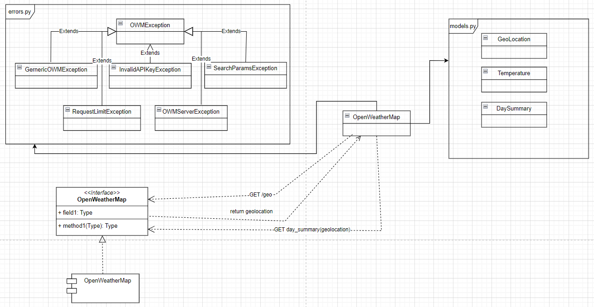

# owmpy
Python SDK to use the OpenWeatherMap API


Before using this module you should possess a API Key from OpenWeatherMap.

Usage Example:
``` python
from owmpy import OpenWeatherMap

weather = OpenWeatherMap("<YOUR-API-KEY>",
                        "Campinas,SP,BR")

forecasts = weather.weather_info(None)
```

The architecture of the solution:
